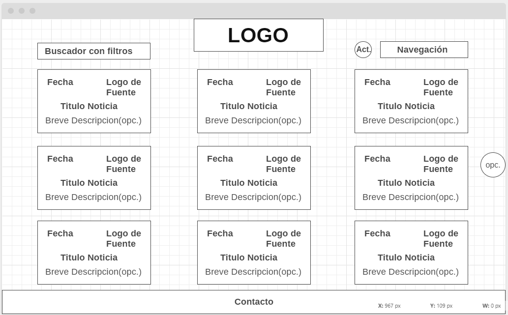
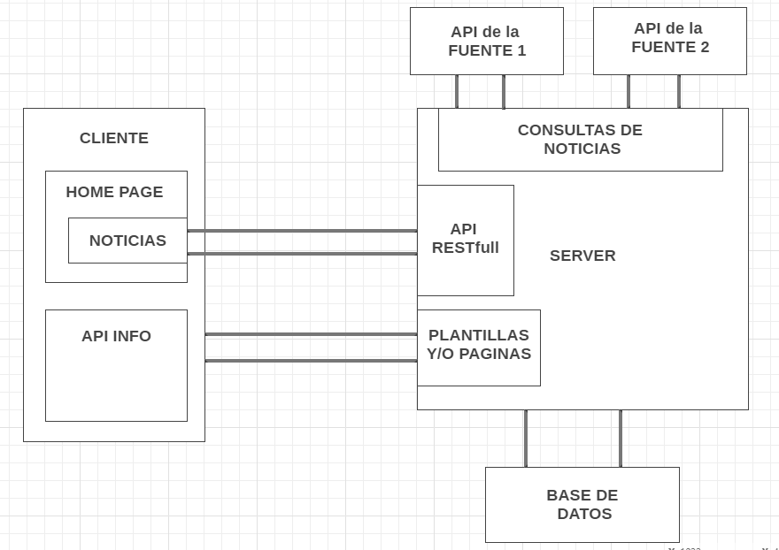

# Proyecto ComIT

## Resumen del Proyecto

En el presente trabajo, se diseñara y desarrollara una pagina de "Noticias Mínimas". 
Esta web app recolectara noticias de distintas fuentes de informacion, las almacenara en un formato propio y las ofrecera al publico general como asi tambien a la pagina propia.

* Se aclara que los elementos y/o paginas que presenten la aclaracion __"(optativo)"__ seran desarrolladas si alcanza el tiempo para la presentacion del primer _MVP_(Producto Mininmo Viable). Sino seran desarroladas posteriormente para agregar mas funcionalidades.

----

## Wireframes

### Home Page

En el wireframe de la __Home Page__ se posicionan y describen los siguientes elementos.

  * Logo
  * Buscador
  * Boton de Actualización de noticias
  * Navegacion
  * Arreglo de Noticias Mínimas
  * Chat de noticias (optativo)
  * Contacto

    

#### Logo

* Se diseñara un logo de acuerdo a la pagina.

#### Buscador

* Si bien las funcionalidades del buscador se iran se desarrollando durante el tiempo que transcurra el proyecto, éste tendra la opcion de buscar por:
  *  _fuente de noticias_
  *  _fecha_
  *  etc.

#### Boton de Actualizacion de noticias

* Este boton sera el encargado de consultar las ultimas noticias al API de _Noticias Minimas_.

#### Navegacion

* En la seccion de Navegación se dispondra de las opciones para navegar dentro de la web app, con opciones de las paginas:
  
  * Home
  * Juegos con Noticias (optativo)
  * API de Mínima Noticias
  * Contacto (optativo)

#### Arreglo de Noticias Mínimas

* En el cuerpo principal de la Home Page habra un arreglo de _Noticias Mínimas_.
* Cada _Noticia Mínima_ estara compuesto por los siguientes elementos:
  * Fecha de la noticia
  * Logo de la fuente de la noticia
  * Titulo de la Noticia
  * Breve Descripcion (optativo)
  * Link hacia la noticia

#### Contacto

* Se ofrecera al cliente distitas vias de comunicacion para realizar consultas y/o apreciaciones de la pagina.


### Juegos con noticias (optativo)

* En esta seccion se dispodra de un arreglo de juegos vinculados con las noticias. 
* Esta seccion es optativo.

    

### API de Noticias Mínimas

* En esta seccion se detallara como poder utilizar la API de "Noticias Minimas".
* Estara documentada con ejemplos para su correcto uso.

  


----

## Diseño de la Arquitectura de Web App

La arquitectura General elegida sera descipta como se indica en el siguiente esquema

  

### Consultas de Noticias - Colector

* El _Colector_ sera responsable de hacer consultas a las distintas fuentes de noticias. 
* Sea cual fuere el retorno de dichas consultas. Las procesara en formato JSON y que cumplan con la _Estructructura de Dato_ para las "Noticias Mínimas". Mas adelante se detallara ésta estructura básica.
* Una vez procesada la informacion consultada sera guardada en la _Base de Datos_.

### Paginas y/o Plantillas

* El _SERVER_ proveera las paginas y/o plantillas necesarias para el _CLIENTE_.
* Éstas luego se iran actualizando segun lo requiera con las con consultas _AJAX_.

### API RESTfull

* Se presenta el diseño basico de la arquitectura a utilizar en la web app. Ésta sera diseñada con arquitectura _RESTfull_.

* La información devuelta por la API sera en formato JSON. Tipicamente las noticias seran en forma de arreglo con la siguiente estructura JSON:
  ```js
  [
      {
          "source" : "pagina12",
          "source-logo" : "logo_pagina12.png",
          "titulo" : "Algun Titulo",
          "fecha" : "25/05/2020",
          "link-noticia" : "pagina12.com/noticia1...",
          "descripcion" : "Alguna breve descripcion de la noticia"
      },
      {
          // mas info...
      }
  ]
  ```
* La cantida de elementos dependera del tipo de consulta que se haga.

----

<!-- ## Planificacion

* Una vez definida las ideas principales del Frontend y el Backend se pasa a planificar de forma tentativa el desarrollo de la web app. -->

